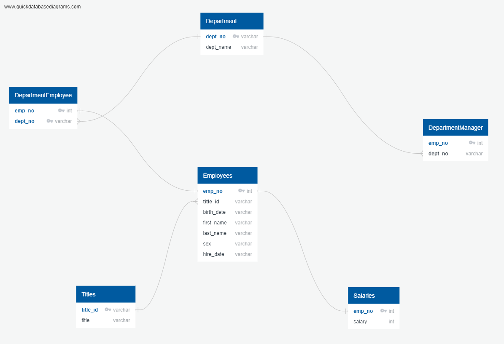
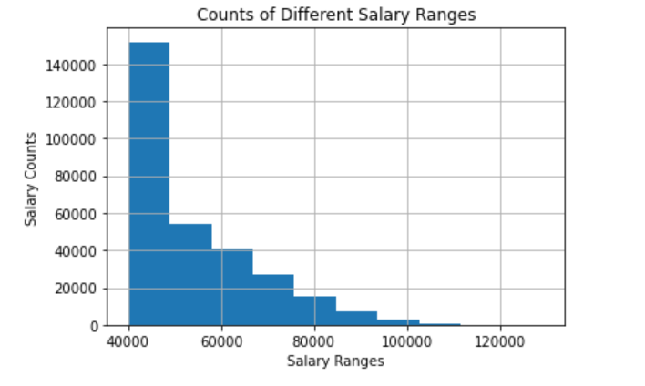

# Using an Employee Data Set to Perform Data Modeling, Engineering, and Analysis with SQL

## Overview

### Data Modeling

An Entity Relationship Diagram was created to model the relationships between the CSVs used.

### Data Engineering

A table schema was created for each of the six CSV files, specifying data types, primary keys, foreign keys, and other constraints.

Each CSV file was imported into their corresponding SQL tables.

### Data Analysis

Once the database was complete, the following were displayed using SQL queries:

* Details of each employee: employee number, last name, first name, sex, and salary.

* First names, last names, and hire dates for employees who were hired in a particular year.

* Managers of each department with their department numbers and names, plus the managers' employee numbers, last names, and first names.

* Department of each employee with their employee numbers, last names, first names, and department names.

* First names, last names, and sexes for employees whose first name is "Hercules" and last names begin with "B."

* All employees in the Sales department, including their employee numbers, last names, first names, and department names.

* All employees in the Sales and Development departments, including their employee numbers, last names, first names, and department names.

* In descending order, the frequency count of employee last names, i.e., how many employees share each last name.

Data was then pulled into jupyter notebook via an engine connection to get a visualization of the counts of different salary ranges as well as the average salary by job title.

## Data

## Tools and Languages
* Database Management: PostgreSQL
* Entity Relationship Diagram: 
* Further Analysis and Plotting: Jupyter Notebook, Plotly
